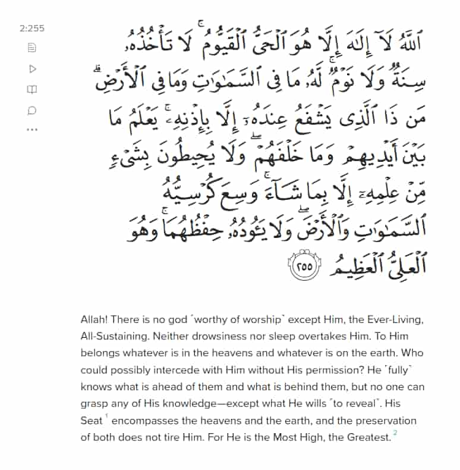

# Juz 1-3

## Surah baqarah

### Summary

- verses 1-10: the believers are those who believe in the unseen, establish prayer, and donate their wealth. The disbelievers have a sickness in their heart, like they are blindfolded from seeing the truth.
- verses 11-30: Allah gives proof as this book is unable to be replicated, It is a linguistic miracle. Allah also refers to his use of parables as a test for those disbelievers, as they will waste time arguing, "what does Allah mean by such a parable?" when they're entirely missing the point. In
  - In verse 30, the angels ask God why he's creating humanity when they are evil. But he puts us there for a reason only he knows.
    > O humanity! Worship your Lord, Who created you and those before you, so that you may become mindful ˹of Him˺
    >
    > And if you are in doubt about what We have revealed to Our servant, then produce a sûrah like it and call your helpers other than Allah, if what you say is true.
- Verses 30-40: Allah created Adam, who knew the names of all things. When Allah ordered the angels to prostrate before Adam, satan refused out of hubris. Adam picked fruit from the tree, and was sent down to earth as a punishment.
- Verses 40-50: To fulfill the covenant with Allah, we need to follow the rules he lay out for us: Establish prayer, give charity, and never deny anything in your religion for something worldly.
  >     Believe in My revelations which confirm your Scriptures. Do not be the first to deny them or trade them for a fleeting gain. And be mindful of Me. Do not mix truth with falsehood or hide the truth knowingly. (41, 42)
- Verses 50-70: Story about Moses
  > Indeed, the believers, Jews, Christians, and Sabians1—whoever ˹truly˺ believes in Allah and the Last Day and does good will have their reward with their Lord. And there will be no fear for them, nor will they grieve. (62)
- Verses 70-90: Don't attribute lies to Allah. Allah also dispels the myth that heaven and hell are temporary. He assures they last forever. Allah points out the hypocrisy in people that pick and choose parts of scripture to follow, rejecting the rest. He also points out how stupid it is to value your temporary life over eternity. This life is a test, and a lot of people don't pass this part. >Do they not know that Allah is aware of what they conceal and what they reveal? (77) >
  >     So woe to those who distort the Scripture with their own hands then say, “This is from Allah”—seeking a fleeting gain! So woe to them for what their hands have written, and woe to them for what they have earned. 79
  >
  >     Worship none but Allah; be kind to parents, relatives, orphans and the needy; speak kindly to people; establish prayer; and pay alms-tax. 85
  >
  >     These are the ones who trade the Hereafter for the life of this world. So their punishment will not be reduced, nor will they be helped. 86
- Verses 90 - 110: Allah establishes that islam will have a broader acceptance for the types of people that can go to heaven.
  >     	Establish prayer, and pay alms-tax. Whatever good you send forth for yourselves, you will ˹certainly˺ find ˹its reward˺ with Allah. Surely Allah is All-Seeing of what you do. 110

Allah says that the Jews claim their superiority over other religions by saying that only their kind will go to heaven, but Allah points out their hypocrisy that they would choose to live 1000 years if they could. Despite being one of the "chosen ones," they fear death and meeting their lord.

Allah also points out their hesitance in accepting new scripture:

> "Why is it that every time they make a covenant, a group of them casts it aside? In fact, most of them do not believe. Now, when a messenger from Allah has come to them—confirming their own Scriptures—some of the People of the Book cast the Book of Allah behind their backs as if they did not know." (100 - 101)

**verses 110 - 120**

> [!NOTE] > **Summary**: It's pointless to argue about which religion is correct - the correct action is to submit to Allah and do good, and all other technicalities between religions are missing the point. Follow divine will, don't ask for signs. Allah doesn't show signs because he knows what happens if he shows people. They will be arrogant and ask for more, always questioning and never believing.

---

Allah says that he selects whoever he wills for his mercy, and that nobody has any right to say "you are going to hell while I am going to heaven." Anybody who submits themselves to Allah and does good will go to heaven.

> "The Jews and Christians each claim that none will enter Paradise except those of their own faith. These are their desires. Reply, ˹O Prophet,˺ “Show ˹me˺ your proof if what you say is true.” But no! Whoever submits themselves to Allah and does good will have their reward with their Lord. And there will be no fear for them, nor will they grieve." (111-112)

Allah also tells people to not excessively ask the prophet for miracles or continuously question him because there is a raison d'etre for everything Allah does, but divine wisdom alone knows what that is, and the creature has no right to determine the precise mode of his Creator's acts -- he should not even ask the why and wherefore of a divine action, but accept it and submit himself to the Divine Will.

> Those who have no knowledge say, “If only Allah would speak to us or a sign would come to us!” The same was said by those who came before. Their hearts are all alike. Indeed, We have made the signs clear for people of sure faith. (118)

Allah doesn't show signs because he knows what happens if he shows people. They will be arrogant and ask for more, always questioning and never believing.

> Never will the Jews or Christians be pleased with you, until you follow their faith. Say, “Allah’s guidance is the only ˹true˺ guidance.” And if you were to follow their desires after ˹all˺ the knowledge that has come to you, there would be none to protect or help you against Allah. (120)

**verses 120 - 130**

> [!NOTE] > **Summary**: Allah describes how Abraham asked for a righteous prophet to be of his offspring, which is Muhammad pbuh. Allah says that anybody who rejects the faith of abraham is a fool.

> Our Lord! Raise from among them a messenger who will recite to them Your revelations, teach them the Book and wisdom, and purify them. Indeed, You ˹alone˺ are the Almighty, All-Wise.” And who would reject the faith of Abraham except a fool! We certainly chose him in this life, and in the Hereafter he will surely be among the righteous.

**verses 130 - 140**

> [!NOTE] > **Summary**: The Jews and Christians argue unnecessarily that the descendants of Abraham were Jews or Christians. Rather they were monotheists, and Islam is the closest religion to true monotheism.

**verses 140 - 150**

> [!NOTE] > **Summary**: When the prophet pbuh asked Allah to change the direction of prayer to the Kabah, the Jews mocked the action. But Allah transcends all directions. It doesn't matter what direction you pray to him in - he will receive your prayers. Praying towards the Kabah is just a request of the prophet pbuh.

Changing the direction of prayer towards the Kabah was just a test. There are some people who would be like, "this is stupid," and would have stopped believing. But the direction doesn't matter. Obeying God despite the banality of this command is the real test here.

> And so We have made you ˹believers˺ an upright1 community so that you may be witnesses over humanity and that the Messenger may be a witness over you. We assigned your former direction of prayer only to distinguish those who would remain faithful to the Messenger from those who would lose faith. It was certainly a difficult test except for those ˹rightly˺ guided by Allah. And Allah would never discount your ˹previous acts of˺ faith. Surely Allah is Ever Gracious and Most Merciful to humanity. (143)

Every religion has their own direction in which they turn towards to pray, and more the muslims it is the Kabah.

**verses 150-160**

> [!NOTE] > **Summary**: Allah gives life advice here, first urging us to seem comfort in patience and prayer. Patience here means enduring hardship. He also says that those martyred are not dead but rather alive - they have fulfilled their purpose on this earth and have transcended the worldly delusion that this universe somehow matters. He also says that testing people with hunger, death, and poverty are inevitable, and those who pass the tests are those who are patient with Allah, saying, "to Allah we belong and to Him we will return."

> Since We have sent you a messenger from among yourselves—reciting to you Our revelations, purifying you, teaching you the Book and wisdom, and teaching you what you never knew—remember Me; I will remember you. And thank Me, and never be ungrateful. (151-152)

> O believers! Seek comfort in patience and prayer. Allah is truly with those who are patient. (153)

> Never say that those martyred in the cause of Allah are dead—in fact, they are alive! But you do not perceive it. (154)

> We will certainly test you with a touch of fear and famine and loss of property, life, and crops. Give good news to those who patiently endure—who say, when struck by a disaster, “Surely to Allah we belong and to Him we will ˹all˺ return.” They are the ones who will receive Allah’s blessings and mercy. And it is they who are ˹rightly˺ guided. (155)

**verses 160 to 170**

> [!NOTE] > **Summary**: Allah says that the earth itself is a miracle, yet it's something most humans cannot appreciate because we take the miraculous miracle of life as granted and cannot appreciate just how wonderful nature and the world truly is.

Allah wants to test our faith. That is why he doesn’t reveal obvious signs, only clear ones like nature.

> Indeed, in the creation of the heavens and the earth; the alternation of the day and the night; the ships that sail the sea for the benefit of humanity; the rain sent down by Allah from the skies, reviving the earth after its death; the scattering of all kinds of creatures throughout; the shifting of the winds; and the clouds drifting between the heavens and the earth—˹in all of this˺ are surely signs for people of understanding. (164)

Those who blindly follow what their ancestors did will be losers in the afterlife. Those people did not know any better than you, so question their beliefs and follow God.

> When it is said to them, “Follow what Allah has revealed,” they reply, “No! We ˹only˺ follow what we found our forefathers practicing.” ˹Would they still do so,˺ even if their forefathers had ˹absolutely˺ no understanding or guidance? (170)

**verses 170 to 190**

> [!NOTE] > **Summary**: Fasting is an act that makes you more mindful of God. Ramadan is the special month when the Quran was revealed, so we must become extra pious this month.

> And to fast is better for you, if only you knew. (184)

> Allah intends ease for you, not hardship, so that you may complete the prescribed period and proclaim the greatness of Allah for guiding you, and perhaps you will be grateful. (185)

> Righteousness is not in turning your faces towards the east or the west. Rather, the righteous are those who believe in Allah, the Last Day, the angels, the Books, and the prophets; who give charity out of their cherished wealth to relatives, orphans, the poor, ˹needy˺ travellers, beggars, and for freeing captives; who establish prayer, pay alms-tax, and keep the pledges they make; and who are patient in times of suffering, adversity, and in ˹the heat of˺ battle. It is they who are true ˹in faith˺, and it is they who are mindful ˹of Allah˺. (177)

> Fight in the cause of Allah ˹only˺ against those who wage war against you, but do not exceed the limits.1 Allah does not like transgressors. (190)

**verses 190 to 200**

> [!NOTE] > **Summary**: These are the verses of fighting where Allah allows people to fight back and and kill their persecutors because persecution is worse than death. But is the persecutors stop, then be merciful and agree for peace.

Jihad is not of the five pillars of Islam, and was only required when Islam was a weak religion. Now that Islam is a strong religion, Jihad is no longer required.

> When you return from ’Arafât,2 praise Allah near the sacred place and praise Him for having guided you, for surely before this ˹guidance˺ you were astray. (198)

Before you were guided, you were astray. Thank Allah for guiding you.

**verses 200 - 210**

> [!NOTE] > **Summary**: Ask Allah for bounty in this world and in the hereafter. Hypocrites often act irritated when somebody tells them to fear God, and their pride will lead them to sin. Whenever someone acts religious around you, take it as good advice and remember to fear God and don't be arrogant.

> “Our Lord! Grant us the good of this world and the Hereafter, and protect us from the torment of the Fire.” (201)

> When it is said to them, “Fear Allah,” pride carries them off to sin. Hell will be their proper place. What an evil place to rest! (206)

**verses 210 - 220**

> [!NOTE] > **Summary**: Allah has another abundance of wisdom here:
>
> - disbelievers will be in hellfire forever.
> - intoxication and gambling have benefits, but the negatives outweigh the benefits
> - Allah has not made his signs obvious because doing so would defeat the purpose of creating humanity in the first place: to test those who will believe or disbelieve.
> - You will be tested severely in this life so Allah can see who are the real believers.
> - Donate what you can. Donate whatever you can spare.
> - Maybe you like something which is bad for you and dislike something which is good for you. Always keep an open mind and realize there are things Allah knows that you do not.

Allah points out the ridiculousness people have in asking him for signs. He makes it abundantly clear that the reason why his signs aren't so comically obvious is because he wants to test people. There is no testing belief if the signs are obvious.

> Are they waiting for Allah ˹Himself˺ to come to them in the shade of clouds, along with the angels? ˹If He did˺, then the matter would be settled ˹at once˺. And to Allah ˹all˺ matters will be returned ˹for judgment˺. Ask the Children of Israel how many clear signs We have given them. And whoever trades Allah’s favour—after receiving it—˹for disbelief˺ should know that Allah is indeed severe in punishment. (210 - 211)

Disbelievers prefer this life to the hereafter while believers prefer the hereafter over this worldly life.

> The life of this world has been made appealing to the disbelievers, and they mock the believers. Those who are mindful ˹of Allah˺ will rank above them on the Day of Judgment. And Allah provides for whoever He wills without limit. (212)

Even the messenger of God himself was tested with poverty, hunger, bodily harm, and all of his loved ones and children dying before him. What makes you think you won't be tested?

> Do you think you will be admitted into Paradise without being tested like those before you? They were afflicted with suffering and adversity and were so ˹violently˺ shaken that ˹even˺ the Messenger and the believers with him cried out, “When will Allah’s help come?” Indeed, Allah’s help is ˹always˺ near. (214)

> They ask you ˹O Prophet in˺ what ˹way˺ they should donate. Say, “Whatever donations you give are for parents, relatives, orphans, the poor, and ˹needy˺ travellers. Whatever good you do is certainly well known to Allah.” (215)

> Perhaps you dislike something which is good for you and like something which is bad for you. Allah knows and you do not know. (216)

**verses 220-240**

> [!NOTE] > **Summary**: Allah discourages making oaths heedlessly as an oath to God is a serious thing. He also talks about the rules for divorce. Shouldn't apply to you because you will die a virgin. The prayer of fear is when you can pray while walking, which is allowed in dire circumstances only.

> Do not use Allah’s Name in your oaths as an excuse for not doing good, not guarding against evil, or not making peace between people. And Allah is All-Hearing, All-Knowing. Allah will not hold you accountable for unintentional oaths, but for what you intended in your hearts. And Allah is All-Forgiving, Most Forbearing. (224 - 225)

> Observe the ˹five obligatory˺ prayers—especially the middle prayer1—and stand in true devotion to Allah. (238)

**verses 240-250**

Allah tells a story of a village of people who fleed to escape a deadly pandemic, but Allah made them die anyway as to show how you can never escape destiny and God. Then a prophet asked Allah to resurrect those people.

> Have you ˹O Prophet˺ not seen those who fled their homes in the thousands for fear of death?1 Allah said to them, “Die!” then He gave them life. Surely Allah is ever Bountiful to humanity, but most people are ungrateful. (243)

Allah says that if you spend your wealth in his cause by donating to charity, he will multiply your wealth many times over.

> Who will lend to Allah a good loan which Allah will multiply many times over? It is Allah ˹alone˺ who decreases and increases ˹wealth˺. And to Him you will ˹all˺ be returned. (245)

**verses 250-260**

> [!NOTE] > **Summary**: Allah delivers some straight up bars here:
>
> - donate your wealth and earn your spot in heaven before it's too late.
> - Allah has knowledge of anything and everything
> - Believing in Allah is like going from the darkness to the light

You have one shot to to well in this world before the day of judgement. Donate your wealth to earn a spot in heaven.

> O believers! Donate from what We have provided for you before the arrival of a Day when there will be no bargaining, friendship, or intercession. Those who disbelieve are ˹truly˺ the wrongdoers. (254)

> Allah! There is no god ˹worthy of worship˺ except Him, the Ever-Living, All-Sustaining. Neither drowsiness nor sleep overtakes Him. To Him belongs whatever is in the heavens and whatever is on the earth. Who could possibly intercede with Him without His permission? He ˹fully˺ knows what is ahead of them and what is behind them, but no one can grasp any of His knowledge—except what He wills ˹to reveal˺. His Seat1 encompasses the heavens and the earth, and the preservation of both does not tire Him. For He is the Most High, the Greatest. (255, ayat al kursi)

Do not force anybody to become muslim, because Islam is clearly the truth and they will arrive to it on their own. Allah likens monotheism to grasping the firmest handhold.

> Let there be no compulsion in religion, for the truth stands out clearly from falsehood.1 So whoever renounces false gods and believes in Allah has certainly grasped the firmest, unfailing hand-hold. And Allah is All-Hearing, All-Knowing. (256)

Allah says that belief is the light and disbelief is the dark. He clarifies our purpose and brings us into the light when we were in the darkness before.

> Allah is the Guardian of the believers—He brings them out of darkness and into light. As for the disbelievers, their guardians are false gods who lead them out of light and into darkness. It is they who will be the residents of the Fire. They will be there forever. (257)

Allah recounts a story of a man who died and was then resurrected after 100 years. The man had no recollection of his death, but saw his decayed donkey by his side. Then Allah resurrected the donkey back to its original form and the man believed in Allah.

> Or ˹are you not aware of˺ the one who passed by a city which was in ruins. He wondered, “How could Allah bring this back to life after its destruction?” So Allah caused him to die for a hundred years then brought him back to life. Allah asked, “How long have you remained ˹in this state˺?” He replied, “Perhaps a day or part of a day.” Allah said, “No! You have remained here for a hundred years! Just look at your food and drink—they have not spoiled. ˹But now˺ look at ˹the remains of˺ your donkey! And ˹so˺ We have made you into a sign for humanity. And look at the bones ˹of the donkey˺, how We bring them together then clothe them with flesh!”1 When this was made clear to him, he declared, “˹Now˺ I know that Allah is Most Capable of everything.” (260)

**verses 260-280**

> [!NOTE] > **Summary**: These are the verses in which Allah relays the virtues of giving charity. He also tells the best way to give charity, which follows these rules:
>
> 1. Give without expecting anything in return
> 2. Do not boast about your charity or admonish the beggar after you give them charity. If you give charity and then use hurtful words after or boast about your generosity, your charity is null and void. Giving away your wealth to just show off is sinful and defeats the purpose of charity.
> 3. Do not donate stuff that has no value to you or stuff that you would not like to receive. Charity is only worth it if you are giving stuff away that you want for yourself, because then it is a worthy sacrifice.
> 4. Giving charity privately is better than giving charity publicly.
>
> Allah has promised that the intention behind charity is more important than what the charity actually accomplishes, meaning you will get the reward if you give charity with good intentions (not hubris, not praise) even if the recipient uses the money for evil.
>
> Whatever the believers give in charity, whether public or private, does not go unnoticed by Allah. He is aware of even the smallest act of kindness and generosity.

> The example of those who spend their wealth in the cause of Allah is that of a grain that sprouts into seven ears, each bearing one hundred grains. And Allah multiplies ˹the reward even more˺ to whoever He wills. For Allah is All-Bountiful, All-Knowing. (261)

> Those who spend their wealth in the cause of Allah and do not follow their charity with reminders of their generosity or hurtful words—they will get their reward from their Lord, and there will be no fear for them, nor will they grieve. (262)

> Kind words and forgiveness are better than charity followed by injury. And Allah is Self-Sufficient, Most Forbearing (263)

> O believers! Do not waste your charity with reminders ˹of your generosity˺ or hurtful words, like those who donate their wealth just to show off and do not believe in Allah or the Last Day. Their example is that of a hard barren rock covered with a thin layer of soil hit by a strong rain—leaving it just a bare stone. Such people are unable to preserve the reward of their charity. Allah does not guide ˹such˺ disbelieving people. (264)

> And the example of those who donate their wealth, seeking Allah’s pleasure and believing the reward is certain,1 is that of a garden on a fertile hill: when heavy rain falls, it yields up twice its normal produce. If no heavy rain falls, a drizzle is sufficient. And Allah is All-Seeing of what you do. (265)

> O believers! Donate from the best of what you have earned and of what We have produced for you from the earth. Do not pick out worthless things for donation, which you yourselves would only accept with closed eyes. (267)

In the quote below, Allah says that the desire to be stingy and fear poverty comes from the devil. Why do you fear being poor anyway? Your life can be taken away in an instant from a plane crash.

> The Devil threatens you with ˹the prospect of˺ poverty and bids you to the shameful deed ˹of stinginess˺, while Allah promises you forgiveness and ˹great˺ bounties from Him. And Allah is All-Bountiful, All-Knowing. (268)

> He grants wisdom to whoever He wills. And whoever is granted wisdom is certainly blessed with a great privilege. But none will be mindful ˹of this˺ except people of reason. (269)

> Whatever charities you give or vows you make are surely known to Allah. And the wrongdoers will have no helpers. To give charity publicly is good, but to give to the poor privately is better for you, and will absolve you of your sins. And Allah is All-Aware of what you do. (270-271)

In the verse below, Allah is saying that even the prophet pbuh himself cannot guide who he wills to Islam. He has no power. Allah also says that charity is good for the soul, as long as they do so without trying to get the approval or praise of people. Whatever people donate to others will be paid back to them in full.

> You are not responsible for people’s guidance ˹O Prophet˺—it is Allah Who guides whoever He wills. Whatever you ˹believers˺ spend in charity, it is for your own good—as long as you do so seeking the pleasure of Allah. Whatever you donate will be paid back to you in full, and you will not be wronged. (272)

> Those who spend their wealth in charity day and night, secretly and openly—their reward is with their Lord, and there will be no fear for them, nor will they grieve. (274)

> Indeed, those who believe, do good, establish prayer, and pay alms-tax will receive their reward from their Lord, and there will be no fear for them, nor will they grieve. (277)

**verses 280-end**

> [!NOTE] > **Summary**: Allah reminds us that he is the all-powerful and that he does not burden any soul with something greater than it cannot bear, which means that whatever challenge Allah gives to us is something we can overcome.

> Be mindful of the Day when you will ˹all˺ be returned to Allah, then every soul will be paid in full for what it has done, and none will be wronged. (281)

> To Allah ˹alone˺ belongs whatever is in the heavens and whatever is on the earth. Whether you reveal what is in your hearts or conceal it, Allah will call you to account for it. He forgives whoever He wills, and punishes whoever He wills. And Allah is Most Capable of everything. (284)

> Allah does not require of any soul more than what it can afford. All good will be for its own benefit, and all evil will be to its own loss. ˹The believers pray,˺ “Our Lord! Do not punish us if we forget or make a mistake. Our Lord! Do not place a burden on us like the one you placed on those before us. Our Lord! Do not burden us with what we cannot bear. Pardon us, forgive us, and have mercy on us. You are our ˹only˺ Guardian. So grant us victory over the disbelieving people.” (286)

### verse of the throne

Here is the ayat al kursi, verse of the throne:

### Favorite quotes

> How can you deny Allah? You were lifeless and He gave you life, then He will cause you to die and again bring you to life, and then to Him you will ˹all˺ be returned. (28)

> ˹Remember˺ when your Lord said to the angels, “I am going to place a successive ˹human˺ authority on earth.” They asked ˹Allah˺, “Will You place in it someone who will spread corruption there and shed blood while we glorify Your praises and proclaim Your holiness?” Allah responded, “I know what you do not know.”1 (30)

> Do you preach righteousness and fail to practice it yourselves, although you read the Scripture? Do you not understand? (44)

> O believers! Seek comfort in patience and prayer. Allah is truly with those who are patient. (153)

> Never say that those martyred in the cause of Allah are dead—in fact, they are alive! But you do not perceive it. (154)

> We will certainly test you with a touch of fear and famine and loss of property, life, and crops. Give good news to those who patiently endure—who say, when struck by a disaster, “Surely to Allah we belong and to Him we will ˹all˺ return.” They are the ones who will receive Allah’s blessings and mercy. And it is they who are ˹rightly˺ guided. (155)

> "Righteousness is not that you turn your faces toward the east or the west, but [true] righteousness is [in] one who believes in Allah, the Last Day, the angels, the Book, and the prophets and gives wealth, in spite of love for it, to relatives, orphans, the needy, the traveler, those who ask [for help], and for freeing slaves; [and who] establishes prayer and gives zakah; [those who] fulfill their promise when they promise; and [those who] are patient in poverty and hardship and during battle. Those are the ones who have been true, and it is those who are the righteous." (177)

> Do you think you will be admitted into Paradise without being tested like those before you? They were afflicted with suffering and adversity and were so ˹violently˺ shaken that ˹even˺ the Messenger and the believers with him cried out, “When will Allah’s help come?” Indeed, Allah’s help is ˹always˺ near. (214)

> They ask you ˹O Prophet in˺ what ˹way˺ they should donate. Say, “Whatever donations you give are for parents, relatives, orphans, the poor, and ˹needy˺ travellers. Whatever good you do is certainly well known to Allah.” (215)

> Perhaps you dislike something which is good for you and like something which is bad for you. Allah knows and you do not know. (216)

> And whoever among you renounces their own faith and dies a disbeliever, their deeds will become void in this life and in the Hereafter. It is they who will be the residents of the Fire. They will be there forever.” (217)

> Be mindful of Allah, and know that you will meet Him. (223)

> Observe the ˹five obligatory˺ prayers—especially the middle prayer1—and stand in true devotion to Allah. (238)

> The example of those who spend their wealth in the cause of Allah is that of a grain that sprouts into seven ears, each bearing one hundred grains. And Allah multiplies ˹the reward even more˺ to whoever He wills. For Allah is All-Bountiful, All-Knowing. (261)

> O believers! Donate from what We have provided for you before the arrival of a Day when there will be no bargaining, friendship, or intercession. Those who disbelieve are ˹truly˺ the wrongdoers. (254)

> Let there be no compulsion in religion, for the truth stands out clearly from falsehood.1 So whoever renounces false gods and believes in Allah has certainly grasped the firmest, unfailing hand-hold. And Allah is All-Hearing, All-Knowing. (256)

> Those who spend their wealth in the cause of Allah and do not follow their charity with reminders of their generosity or hurtful words—they will get their reward from their Lord, and there will be no fear for them, nor will they grieve. (262)

> Kind words and forgiveness are better than charity followed by injury. And Allah is Self-Sufficient, Most Forbearing (263)

> O believers! Do not waste your charity with reminders ˹of your generosity˺ or hurtful words, like those who donate their wealth just to show off and do not believe in Allah or the Last Day. Their example is that of a hard barren rock covered with a thin layer of soil hit by a strong rain—leaving it just a bare stone. Such people are unable to preserve the reward of their charity. Allah does not guide ˹such˺ disbelieving people. (264)

> And the example of those who donate their wealth, seeking Allah’s pleasure and believing the reward is certain,1 is that of a garden on a fertile hill: when heavy rain falls, it yields up twice its normal produce. If no heavy rain falls, a drizzle is sufficient. And Allah is All-Seeing of what you do. (265)

> O believers! Donate from the best of what you have earned and of what We have produced for you from the earth. Do not pick out worthless things for donation, which you yourselves would only accept with closed eyes. (267)

> The Devil threatens you with ˹the prospect of˺ poverty and bids you to the shameful deed ˹of stinginess˺, while Allah promises you forgiveness and ˹great˺ bounties from Him. And Allah is All-Bountiful, All-Knowing. (268)

> To give charity publicly is good, but to give to the poor privately is better for you, and will absolve you of your sins. (271)

> Those who spend their wealth in charity day and night, secretly and openly—their reward is with their Lord, and there will be no fear for them, nor will they grieve. (274)

> Indeed, those who believe, do good, establish prayer, and pay alms-tax will receive their reward from their Lord, and there will be no fear for them, nor will they grieve. (277)

> Be mindful of the Day when you will ˹all˺ be returned to Allah, then every soul will be paid in full for what it has done, and none will be wronged. (281)

> Allah does not require of any soul more than what it can afford. All good will be for its own benefit, and all evil will be to its own loss. (286)
